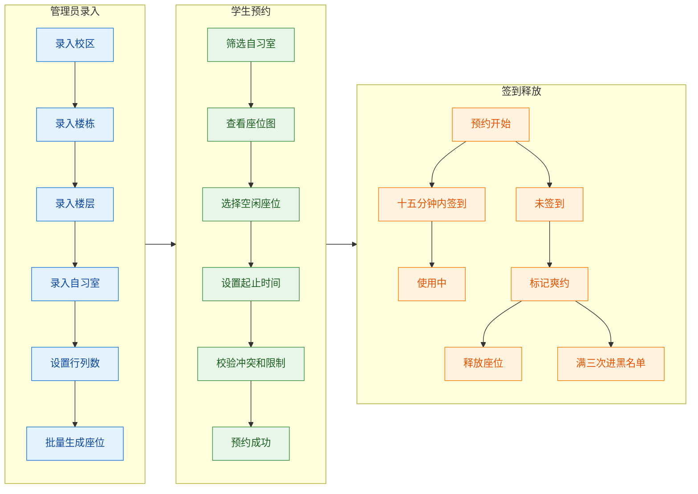

# SeatFlow 需求与设计

## 目录

- [业务目标](#业务目标)
- [角色权限](#角色权限)
- [功能需求](#功能需求)
- [核心流程](#核心流程)
- [后端和前端落位](#后端和前端落位)
- [接口边界](#接口边界)
- [数据库表](#数据库表)
- [状态枚举](#状态枚举)
- [索引和事务](#索引和事务)
- [报表口径](#报表口径)
- [演示数据](#演示数据)
- [不进入第一版](#不进入第一版)

## 业务目标

SeatFlow 第一版要能支撑完整答辩流程：管理员录入自习室和座位，学生按条件筛选自习室并预约座位，系统限制冲突预约，学生在预约开始后 15 分钟内签到，未签到预约由定时任务释放，爽约满 3 次进入黑名单，报表能展示热力图、日均使用率和热门时段。

## 角色权限

| 角色 | 默认账号 | 菜单和能力 |
| --- | --- | --- |
| 管理员 | `admin` | 基础信息、座位管理、黑名单、报表、系统管理 |
| 学生 | `student01`、`student02` | 座位预约、我的预约、签到 |

账号体系复用 RuoYi `sys_user`。学生档案放入 `seatflow_user_profile`，保存学号、爽约次数和黑名单标记。学生不能看到管理员菜单，也不能调用管理员接口。

## 功能需求

### 基础信息管理

管理员维护校区、楼栋、楼层、自习室、座位。层级固定为校区、楼栋、楼层、自习室、座位。

自习室字段至少包括名称、开放时间、关闭时间、行数、列数、状态。管理员输入行列数后批量生成座位。座位字段至少包括座位编号、行号、列号、状态。第一版座位编号保持简单一致，例如 `A01`、`A02`。

基础信息最低要求：

- 校区、楼栋、楼层、自习室支持新增、修改、删除、查询。
- 删除上级数据前检查下级数据。
- 座位支持按自习室查询，支持启用和停用。
- 已有座位的自习室再次批量生成时，第一版直接拒绝覆盖。

### 学生预约

学生按校区、楼栋、楼层、自习室筛选座位。座位图显示空闲、已预约、使用中、停用四类状态。

预约采用起止时间段。提交时检查：

- 学生不在黑名单。
- 学生当天预约次数未超过限制，第一版默认每天最多 1 次。
- 开始时间早于结束时间。
- 预约时间在自习室开放时间内。
- 同一学生没有时间重叠的有效预约。
- 同一座位没有时间重叠的有效预约。
- 座位不是停用状态。

学生可以在预约开始前取消预约。第一版不做取消惩罚，取消后释放占用。

### 座位管控

预约开始后 15 分钟内允许签到。签到成功后，预约状态变为 `in_use`，签到记录写入 `seatflow_checkin_record`。

超时未签到由 RuoYi Quartz 任务处理。任务扫描 `pending_checkin` 且 `check_deadline` 早于当前时间的预约，将其标记为 `no_show`，写入爽约记录，增加学生爽约次数。爽约满 3 次后，学生进入黑名单。

黑名单第一版为永久限制。管理员可以查看黑名单。解除机制后续按需要扩展。

### 数据报表

报表第一版从业务表实时聚合，不建每日汇总表。

| 报表 | 口径 |
| --- | --- |
| 座位热力图 | 日期范围内每个座位的预约次数或使用分钟数 |
| 日均使用率 | 有效使用分钟数除以启用座位开放分钟数 |
| 热门时段 | 按小时或半小时统计预约数量 |
| 自习室排行 | 按预约次数、签到次数或使用率排序 |

页面用 ECharts 展示。口径要简单，数据要能用演示数据复现。

## 核心流程



## 后端和前端落位

后端新增 `ruoyi-seatflow` 模块，`ruoyi-admin` 依赖它。业务包名使用 `com.ruoyi.seatflow`。

| 后端层 | 约定 |
| --- | --- |
| Controller | 路径统一以 `/seatflow` 开头，沿用 RuoYi 返回结构和权限注解 |
| Service | 持有事务边界，预约提交、取消、签到、释放都在 Service 完成 |
| Mapper | 使用 MyBatis XML，复杂 SQL 直接写清楚 |
| Domain | 对应数据库表 |
| DTO | 页面查询、提交参数、报表返回 |
| Quartz Job | 放在管控模块，由 RuoYi 定时任务管理 |

前端页面放在 `src/views/seatflow`，API 封装放在 `src/api/seatflow`。管理端页面按 `base-info`、`control`、`blacklist`、`report` 分目录，学生端页面按 `reservation`、`my-reservation`、`control` 分目录。

## 接口边界

| 业务域 | 路径前缀 | 说明 |
| --- | --- | --- |
| 基础信息 | `/seatflow/base` | 校区、楼栋、楼层、自习室、座位 |
| 预约 | `/seatflow/reservation` | 可预约查询、提交预约、取消、我的预约 |
| 管控 | `/seatflow/control` | 签到、黑名单、爽约记录 |
| 报表 | `/seatflow/report` | 热力图、使用率、热门时段 |

权限标识统一以 `seatflow:` 开头，例如 `seatflow:reservation:create`。

## 数据库表

业务表统一使用 `seatflow_` 前缀。ER 草图见 [study-room-booking-er.mmd](./study-room-booking-er.mmd)。

| 表名 | 说明 | 关键字段 |
| --- | --- | --- |
| `seatflow_user_profile` | 学生档案 | `profile_id`、`user_id`、`student_no`、`violation_count`、`blacklist_flag` |
| `seatflow_campus` | 校区 | `campus_id`、`campus_name`、`address`、`status` |
| `seatflow_building` | 楼栋 | `building_id`、`campus_id`、`building_name`、`floor_count`、`status` |
| `seatflow_floor` | 楼层 | `floor_id`、`building_id`、`floor_number`、`floor_name`、`status` |
| `seatflow_room` | 自习室 | `room_id`、`floor_id`、`room_name`、`row_count`、`col_count`、`total_seats`、`open_time`、`close_time`、`status` |
| `seatflow_seat` | 座位 | `seat_id`、`room_id`、`seat_no`、`row_num`、`col_num`、`status` |
| `seatflow_reservation` | 预约 | `reservation_id`、`user_id`、`room_id`、`seat_id`、`start_time`、`end_time`、`check_deadline`、`status`、`cancel_time` |
| `seatflow_checkin_record` | 签到记录 | `checkin_id`、`reservation_id`、`user_id`、`checkin_time`、`status` |
| `seatflow_violation_record` | 爽约记录 | `violation_id`、`reservation_id`、`user_id`、`reason`、`violation_time`、`status` |
| `seatflow_blacklist` | 黑名单 | `blacklist_id`、`user_id`、`violation_id`、`reason`、`start_time`、`end_time`、`status` |

创建时间、更新时间、备注等字段可以沿用 RuoYi 常见字段。是否加数据库外键由 infra 统一决定，业务代码必须按上述关系处理。

## 状态枚举

状态字段使用 `varchar` 语义码，方便 SQL、接口和页面调试。

| 类型 | 值 |
| --- | --- |
| 座位状态 | `enabled`、`disabled` |
| 预约状态 | `pending_checkin`、`in_use`、`cancelled`、`no_show`、`completed` |
| 黑名单标记 | `yes`、`no` |
| 记录状态 | `active`、`inactive` |

有效占座状态只包括 `pending_checkin` 和 `in_use`。`cancelled`、`no_show`、`completed` 不参与座位冲突。

## 索引和事务

建议索引：

| 表 | 索引 | 用途 |
| --- | --- | --- |
| `seatflow_building` | `(campus_id)` | 按校区查楼栋 |
| `seatflow_floor` | `(building_id)` | 按楼栋查楼层 |
| `seatflow_room` | `(floor_id)` | 按楼层查自习室 |
| `seatflow_seat` | `(room_id, row_num, col_num)` | 座位图和批量生成校验 |
| `seatflow_seat` | `(room_id, seat_no)` 唯一 | 同一自习室座位编号不重复 |
| `seatflow_reservation` | `(seat_id, start_time, end_time, status)` | 校验座位时间冲突 |
| `seatflow_reservation` | `(user_id, start_time, status)` | 校验学生当天限制和时间冲突 |
| `seatflow_reservation` | `(status, check_deadline)` | 定时任务扫描超时未签到 |
| `seatflow_blacklist` | `(user_id, status)` | 预约前黑名单校验 |

提交预约的事务流程：

1. 开启事务。
2. 用 `SELECT ... FOR UPDATE` 锁定目标 `seatflow_seat` 行。
3. 检查座位启用、学生未进黑名单、当天次数未超限。
4. 检查同一学生是否有重叠有效预约。
5. 检查同一座位是否有重叠有效预约。
6. 插入 `seatflow_reservation`，状态为 `pending_checkin`。
7. 提交事务。

时间重叠条件：

```sql
existing.start_time < new_end_time
and existing.end_time > new_start_time
```

## 报表口径

热力图、使用率、热门时段都从 `seatflow_reservation`、`seatflow_checkin_record`、`seatflow_seat` 聚合。日均使用率第一版按有效使用分钟数除以启用座位开放分钟数计算。这个口径简单，答辩时也容易讲清。

## 演示数据

infra 准备演示数据：

- 2 个校区。
- 每个校区 1 到 2 栋楼。
- 每栋楼 2 到 3 层。
- 每层 1 到 2 个自习室。
- 每个自习室 20 到 60 个座位。
- 账号 `admin`、`student01`、`student02`。
- 预约数据覆盖空闲、已预约、使用中、爽约、黑名单、热门时段。

演示数据要支撑一条完整链路：管理员建房间，学生预约，另一个学生冲突失败，学生签到，超时任务释放座位，报表有可见统计。

## 不进入第一版

第一版不做扫码硬件签到、地图导航、支付、消息队列通知、Redis 业务缓存、多校区复杂数据权限。RuoYi 的部门、岗位表可以保留，SeatFlow 业务不依赖它们。
