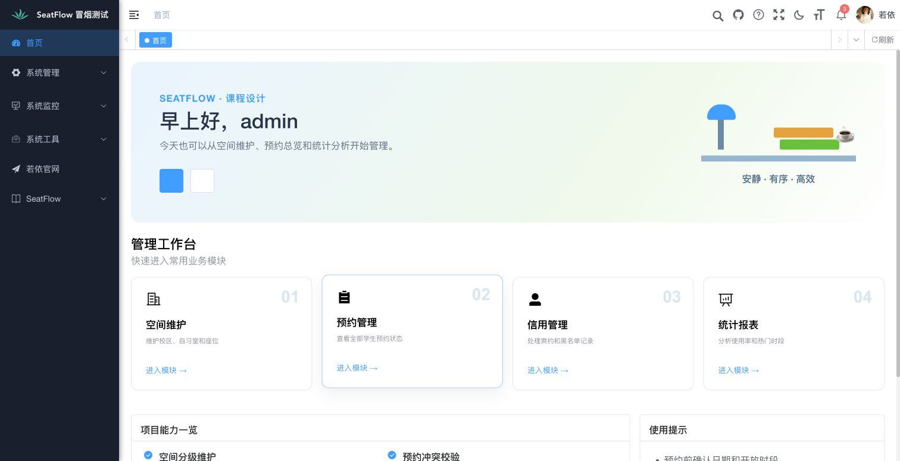
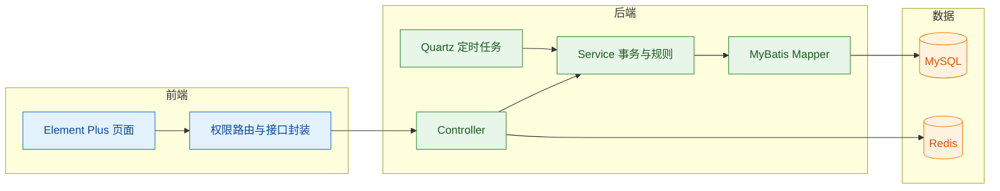
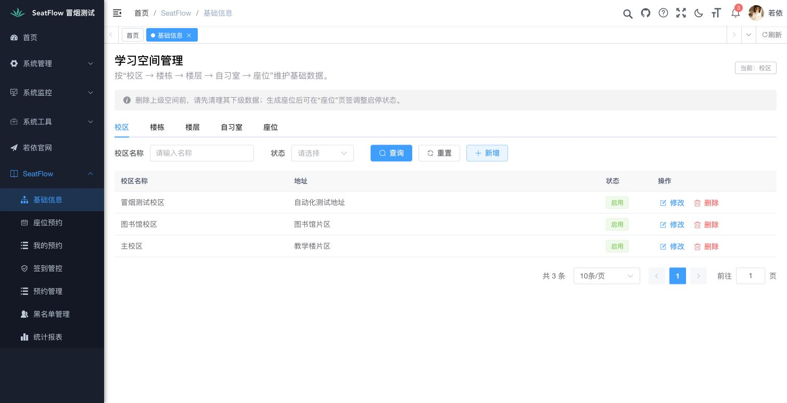
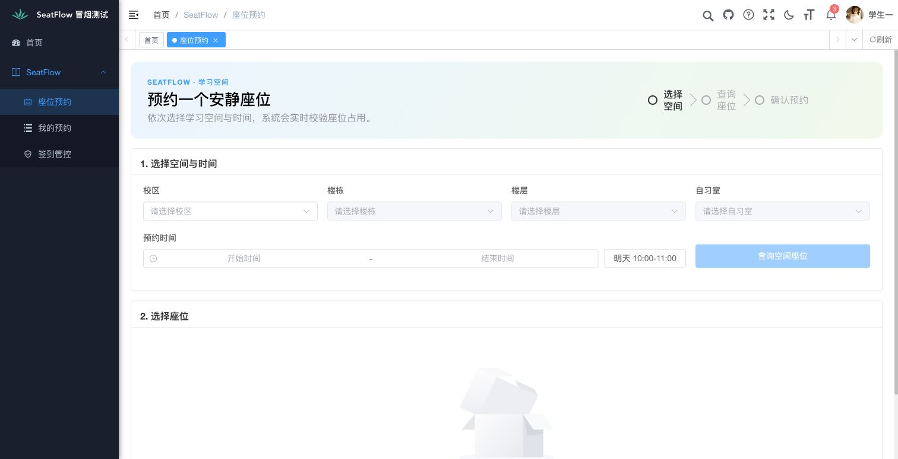
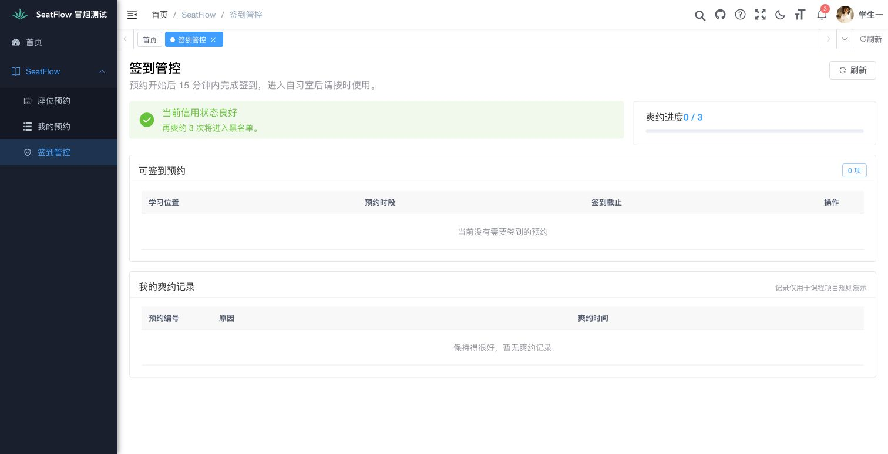
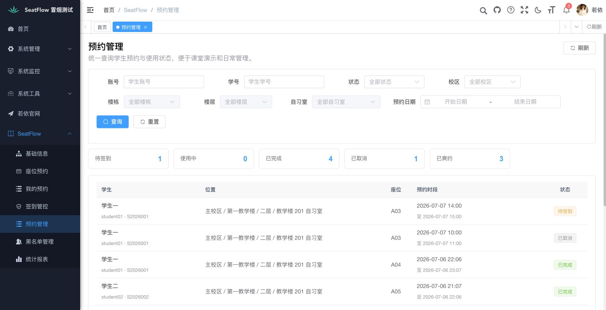
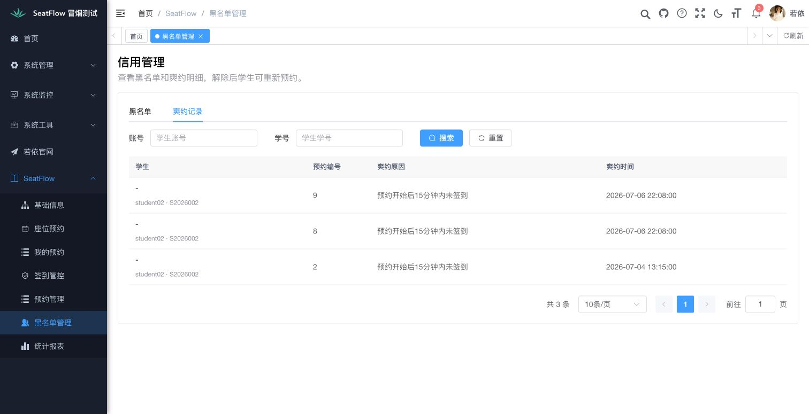
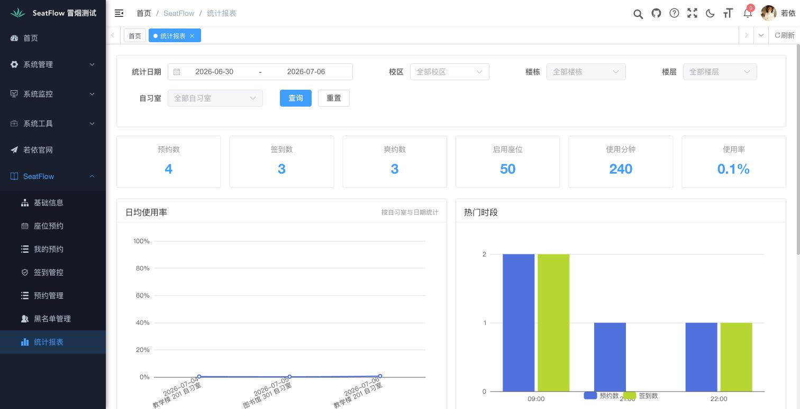

# SeatFlow 自习室预约系统实验报告

## 目录

- [一、项目目标](#一项目目标)
- [二、架构与数据](#二架构与数据)
- [三、核心实现](#三核心实现)
- [四、测试结果](#四测试结果)
- [五、问题修复](#五问题修复)
- [六、项目总结](#六项目总结)

## 一、项目目标

SeatFlow 面向校园自习室预约场景，目标是让管理员能维护学习空间、处理预约与信用记录，让学生能完成预约、取消、签到和结束使用。项目保留若依的登录、菜单和权限体系，采用单体架构，重点练习分层设计、事务控制、定时任务、前后端联调与自动化测试。

首页根据角色给出不同入口。管理员关注空间、预约、信用和报表，学生关注预约、签到与个人记录，避免把无权限功能暴露在菜单中。

## 二、架构与数据

业务仍采用 `controller -> service -> mapper`，Controller 负责鉴权和参数接收，Service 统一处理状态迁移、事务和冲突判断。MySQL 保存空间、座位、预约、黑名单和爽约记录；Redis 保存登录与权限缓存；Quartz 定期处理未签到和使用超时。

预约表增加实际完成时间，并为状态与结束时间建立组合索引。校区、楼栋、楼层、自习室增加层级唯一约束；黑名单按学生唯一保存，解除后记录失效而不删除历史爽约。初始化 SQL 使用相对当前日期的演示数据，重新建库后仍能看到待签到、使用中、已完成和爽约状态。

## 三、核心实现

预约页按“选择空间与时间—查询座位—确认预约”组织操作，并提供明日快捷时段。提交时会校验开放时间、每日限次、学生时间冲突、座位冲突和黑名单；座位冲突使用事务内加锁避免并发重复预约。

学生可在开始后 15 分钟内签到，也可提前结束使用。Quartz 将超过签到截止时间的预约标记为爽约，将超过结束时间且仍在使用的预约自动完成。累计三次爽约后学生进入黑名单；管理员解除时清零计数并恢复预约资格，历史记录继续保留。

管理员预约管理支持账号、学号、空间、状态和日期筛选，并汇总各状态数量。信用管理分开显示当前黑名单与爽约明细，统计报表支持空间级联筛选，展示预约、签到、爽约、使用时长和使用率。

## 四、测试结果

| 检查项 | 结果 |
| --- | --- |
| SeatFlow Service 单元测试 | 26 项通过 |
| 独立 MySQL Playwright 冒烟 | 4 个完整场景通过 |
| Chrome 人工可视验收 | 管理员、学生页面及权限通过 |
| 浏览器控制台 | 未发现错误日志 |
| SeatFlow ESLint 与前端生产构建 | 通过 |
| Spotless 与 Maven 全量测试 | 通过 |

冒烟测试使用独立的 `seatflow_smoke` 数据库，重置脚本会拒绝普通库名，防止清理开发数据。场景覆盖空间和座位生成、预约与取消、两人抢同一座位、签到与手动/自动完成、三次爽约拉黑、解除恢复、学生菜单隔离、管理员接口 403、预约总览和报表数据。

## 五、问题修复

联调中发现黑名单查询在关闭下划线自动映射时，部分字段会返回空值。原因是 SQL 别名未与 Java 属性名完全对应，现已改为显式别名，并用真实 MySQL 冒烟覆盖。浏览器测试还发现账号切换后必须重新加载动态权限路由；正常登录流程已验证学生只显示预约、我的预约和签到管控。

为提高可读性，SeatFlow Java 代码统一构造器注入和 Google Java Format，复杂事务、并发锁与状态迁移保留简洁中文注释。前端仅检查 SeatFlow 页面，未批量改动若依上游代码。

## 六、项目总结

项目已形成“维护空间—预约座位—签到使用—结束或超时—信用处理—统计分析”的完整闭环。实现没有追求生产级微服务或复杂中间件，而是把课程项目最容易出错的权限、时间、并发和状态边界做成可重复测试。后续若继续扩展，可加入预约通知和更细的开放日历，但当前版本已满足小组展示与实验验收需要。
