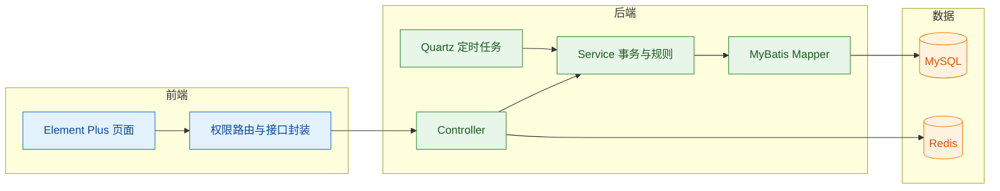
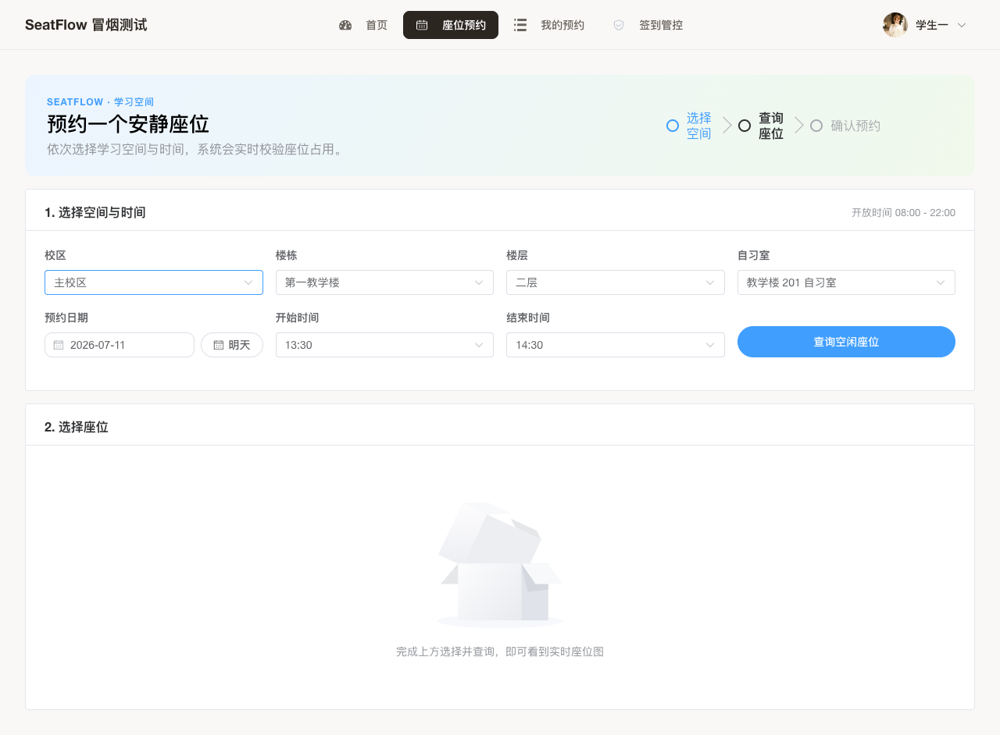
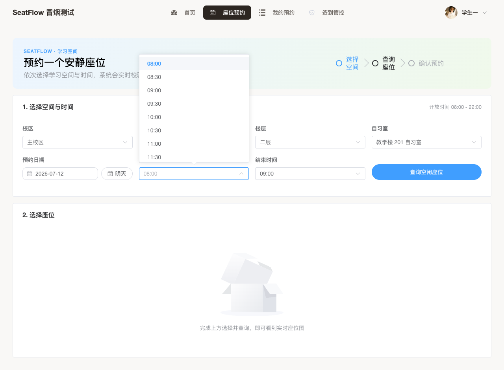
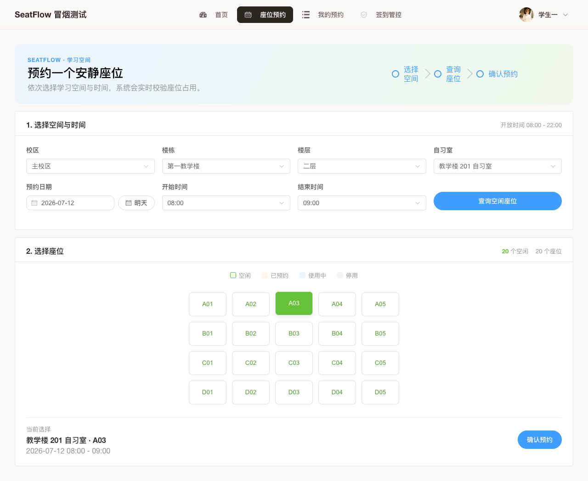
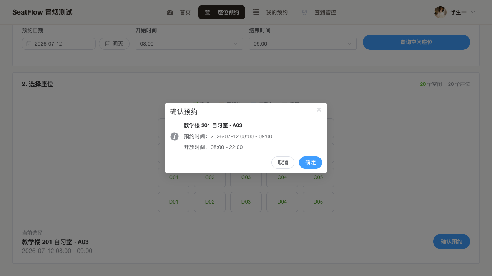
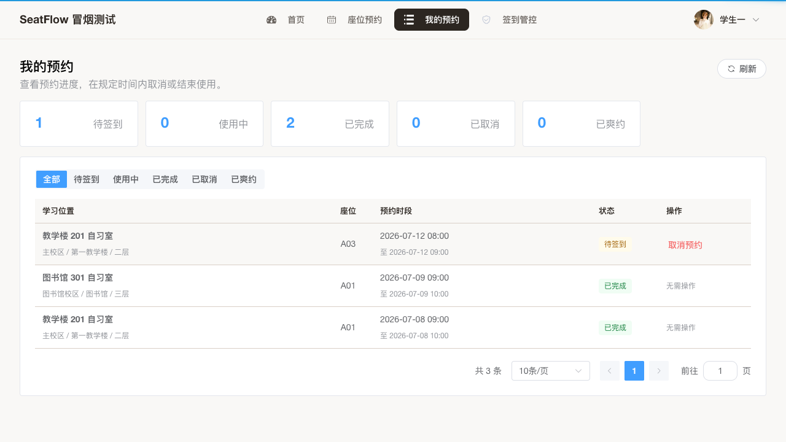
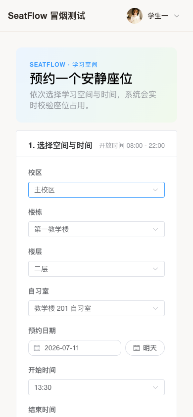

# SeatFlow 自习室预约系统实验报告

## 目录

- [一、项目目标](#一项目目标)
- [二、架构与数据](#二架构与数据)
- [三、核心实现](#三核心实现)
- [四、测试结果](#四测试结果)
- [五、问题修复](#五问题修复)
- [六、项目总结](#六项目总结)

## 一、项目目标

SeatFlow 面向校园自习室预约场景，目标是让管理员能维护学习空间、处理预约与信用记录，让学生能完成预约、取消、签到和结束使用。项目保留若依的登录、菜单和权限体系，采用单体架构，重点练习分层设计、事务控制、定时任务、前后端联调与自动化测试。

课程验收阶段以“流程打通、界面可演示、结果可复现”为准。顶部导航按角色收敛，学生只保留预约、我的预约和签到管控；管理员可进入基础信息、预约管理、信用管理和统计报表。首页继续保留课程展示入口，真正的权限约束由菜单与后端接口共同兜底。

## 二、架构与数据

业务仍采用 `controller -> service -> mapper`，Controller 负责鉴权和参数接收，Service 统一处理状态迁移、事务和冲突判断。MySQL 保存空间、座位、预约、黑名单和爽约记录；Redis 保存登录与权限缓存；Quartz 定期处理未签到和使用超时。

预约表增加实际完成时间，并为状态与结束时间建立组合索引。校区、楼栋、楼层、自习室增加层级唯一约束；黑名单按学生唯一保存，解除后记录失效而不删除历史爽约。初始化 SQL 使用相对当前日期的演示数据，重新建库后仍能看到待签到、使用中、已完成和爽约状态。

## 三、核心实现

预约页按“选择空间与时间—查询座位—确认预约”组织操作。空间层级只有一个选项时会自动向下选中；时间按上海时区取下一个 30 分钟作为起点，默认预约 1 小时，当天剩余开放时间不足时切到次日。日期、开始时间和结束时间分开选择，时刻列表只包含自习室开放区间，避免先选错再等待后端报错。

查座后仍由后端校验开放时间、每日限次、学生时间冲突、座位冲突和黑名单；座位冲突使用事务内加锁避免并发重复预约。座位使用中文可访问名称并标记选中状态，确认框重新列出学习位置、预约时段和开放时间，减少误操作。

学生和管理员的状态数量改为后端独立聚合，不再用当前页记录计算。学生切换状态后仍能看到全部预约分布；管理端汇总保留账号、空间和日期条件，但不受当前状态筛选影响。

预约页在 390 像素宽度下改为单列排列，时间控件和按钮保持完整，没有出现文字遮挡或横向溢出。

学生可在开始后 15 分钟内签到，也可提前结束使用。Quartz 将超过签到截止时间的预约标记为爽约，将超过结束时间且仍在使用的预约自动完成。累计三次爽约后学生进入黑名单；管理员解除时清零计数并恢复预约资格，历史记录继续保留。真实冒烟已覆盖“签到成功、手动结束、Quartz 自动完成、三次爽约拉黑、管理员解除恢复”这一整条控制链。

管理员预约管理支持账号、学号、空间、状态和日期筛选，并汇总各状态数量。信用管理分开显示当前黑名单与爽约明细，统计报表支持空间级联筛选，展示预约、签到、爽约、使用时长和使用率。

## 四、测试结果

| 检查项 | 结果 |
| --- | --- |
| `mise exec maven@3.9.16 -- mvn -pl ruoyi-seatflow -am test` | 29 项通过 |
| `cd seatflow-ui && npm run lint:seatflow` | 通过 |
| `cd seatflow-ui && npm run build:prod` | 通过 |
| `cd seatflow-ui && npm run smoke:report` | 独立 `seatflow_smoke` 数据库 4 个完整场景通过，生成 HTML 报告和 6 张预约证据图 |
| 浏览器人工可视验收 | 预约默认时段、受限时刻、选座、确认框、状态统计及 390 像素移动端已逐项检查 |
| 浏览器控制台 | 未发现错误日志 |

真实冒烟统一由 `scripts/smoke/run.sh` 执行。`npm run smoke:report` 会重置独立 `seatflow_smoke` 数据库、启动 smoke profile 后端与前端、运行 4 个 Playwright 场景，并将 HTML 报告写入 `seatflow-ui/test-results/report/`。重置脚本会拒绝普通库名，避免误清开发库。场景覆盖空间维护、预约默认时间和开放时刻、预约与取消、全量状态统计、两人抢同一座位、签到与手动/自动完成、三次爽约拉黑、解除恢复、学生顶部菜单隔离、管理员接口 403、预约总览和报表数据。

## 五、问题修复

本轮先处理预约时间。原页面默认留空，通用日期时间控件允许选择开放区间外的时刻，错误只能在提交后发现。现在由页面给出推荐时段，并把选项限制在开放时间内；座位查询接口也拒绝过去时段，前后端口径保持一致。

第二处问题是状态卡片直接统计当前分页数据。切换状态或翻页后，其他状态会显示为 0，容易把页面记录数误认为全量结果。现在学生端和管理端分别使用独立汇总接口，页面筛选和分页不再改变统计口径。

烟测增加报告模式后，成功场景会保存预约关键截图，失败时仍保留 Playwright trace 和错误截图。实验报告中的预约图片来自本轮真实 Chrome 操作，后续修改主流程时可以用同一命令重新生成。

## 六、项目总结

项目已形成“维护空间—预约座位—签到使用—结束或超时—信用处理—统计分析”的完整闭环。实现没有追求生产级微服务或复杂中间件，而是把课程项目最容易翻车的权限、时间、并发和状态边界做成可重复测试，并用真实截图与真实冒烟结果留痕。当前版本已经满足小组展示、实验报告和课程验收需要。
